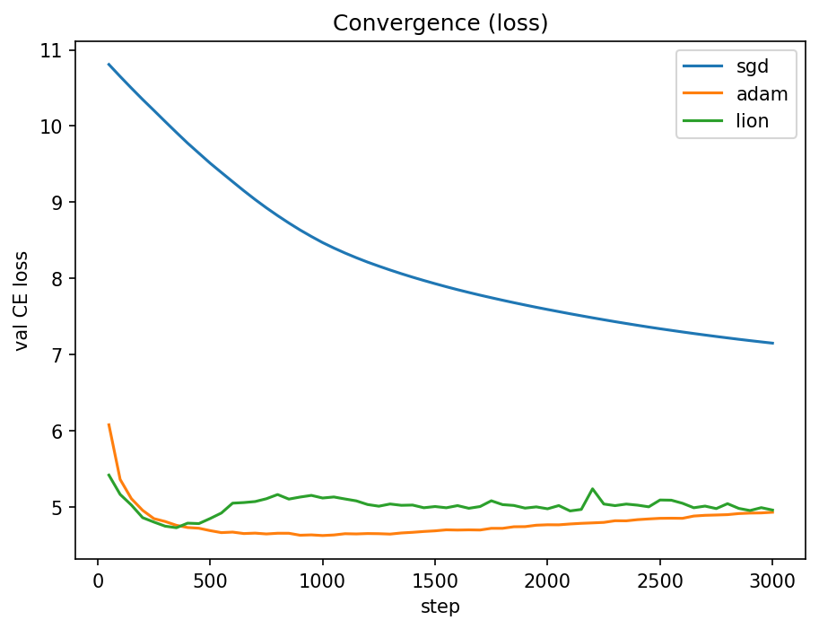
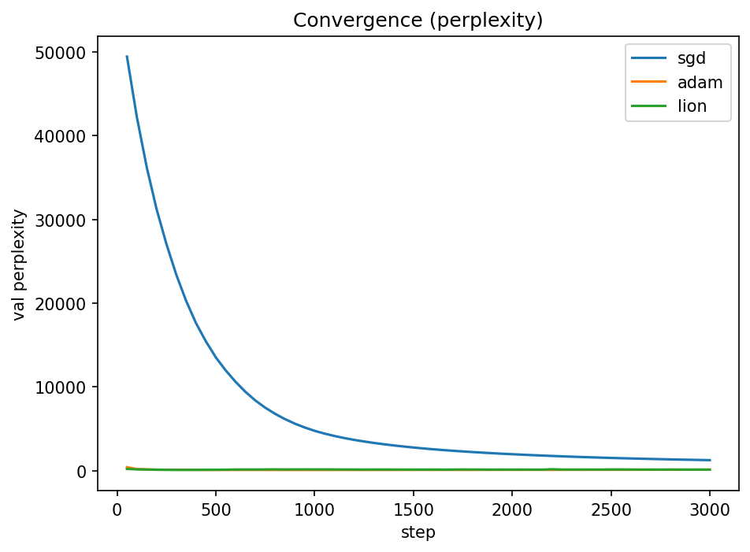
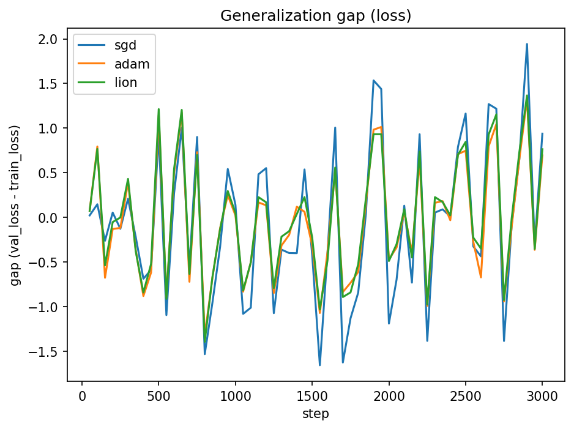

# Analysis Report

This report summarizes the optimizer comparison on the autoregressive LM task, with **perplexity** as the primary metric. Results are based on the convergence plots and the multi‑seed summary table.

## Convergence (validation)

**Loss**  

**Perplexity**  

## Generalization gap
Gap is `val_loss − train_loss` (lower is better; ≈0 indicates well‑matched fit).  

## Observations

- **Adam** converges to the lowest validation loss and perplexity. The curve is smooth and continues a mild downward trend, indicating stable optimization at the chosen LR/WD.
- **Lion** tracks Adam early, but remains slightly higher for most of training and shows small bumps later—suggesting more LR sensitivity or less effective curvature adaptation at these hyper‑parameters.
- **SGD** lags far behind: validation loss remains much higher and perplexity stays orders of magnitude larger, may need more epoches to converge.
- **Generalization gap** oscillates around zero with frequent sign changes and small magnitude for Adam/Lion; SGD exhibits larger swings when it makes progress.

## Multi‑seed summary
Means ± std (over seeds) from `multi_seed_summary.csv`:

| optimizer | val_loss_mean | val_loss_std | val_ppl_mean | val_ppl_std | n_runs |
| --- | --- | --- | --- | --- | --- |
| sgd | 7.1939 | 0.0185 | 1331.4404 | 24.4955 | 3 |
| adam | 4.9314 | 0.0071 | 138.5747 | 0.9838 | 3 |
| lion | 5.0818 | 0.16 | 162.4185 | 25.0189 | 3 |

### Ranking (lower loss/ppl is better)
1. **adam** – loss 4.9314±0.0071, ppl 138.5747±0.9838 (n=3)
2. **lion** – loss 5.0818±0.1600, ppl 162.4185±25.0189 (n=3)
3. **sgd** – loss 7.1939±0.0185, ppl 1331.4404±24.4955 (n=3)

## Sharpness Summary

| Optimizer | Best Val Loss ↓ | Sharpness Δ (mean) ↓ | Sharpness Δ (std) ↓ |
|---|---:|---:|---:|
| Lion | 4.6869 | 0.0381 | 0.0014 |
| Adam | 4.6518 | 1.8571 | 0.3548 |
| SGD  | 7.2101 | 1.8467 | 0.4619 |

**Sharpness (Δ).** Lower Δ means a flatter, more robust basin. Lion lands in the flattest region (Δ≈0.038) while Adam and SGD are much sharper (Δ≈1.85), with Adam slightly edging best validation loss. In short: Lion → robustness; Adam → best fit; SGD → sharp & higher loss.

## Limitations & Further Work

- **Batching & schedule**: Increase batch size; try warmup + cosine decay. Small batches amplify noise in loss and gap.
- **Large losses/perplexities**: Train with a stronger model, verify tokenization and padding masks, and consider better dataset filtering. Tune weight decay and add dropout scheduling.
- **Broader evaluation**: Add downstream tasks (classification, translation, summarization) to test if optimizer ordering holds beyond next‑token prediction.
- **More optimizers**: Try **L‑BFGS**, **AdamW**, **Adafactor**, **RMSProp**; sweep learning rates and plot stability regions.
- **Variance & sensitivity**: Use ≥5 seeds and report 95% CIs; run LR range tests; plot heatmaps of val loss over {optimizer × LR}.
